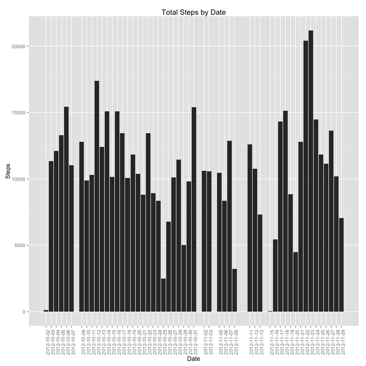
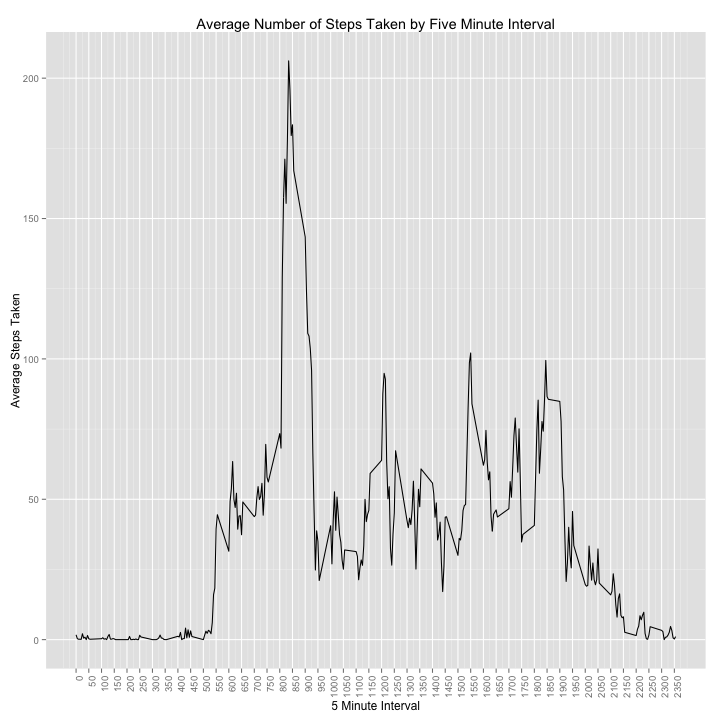
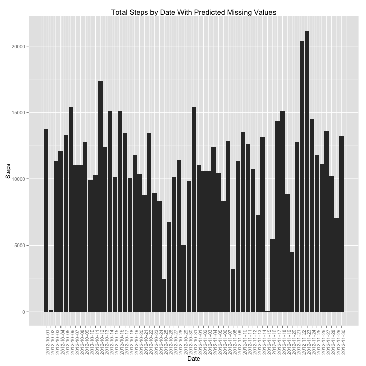
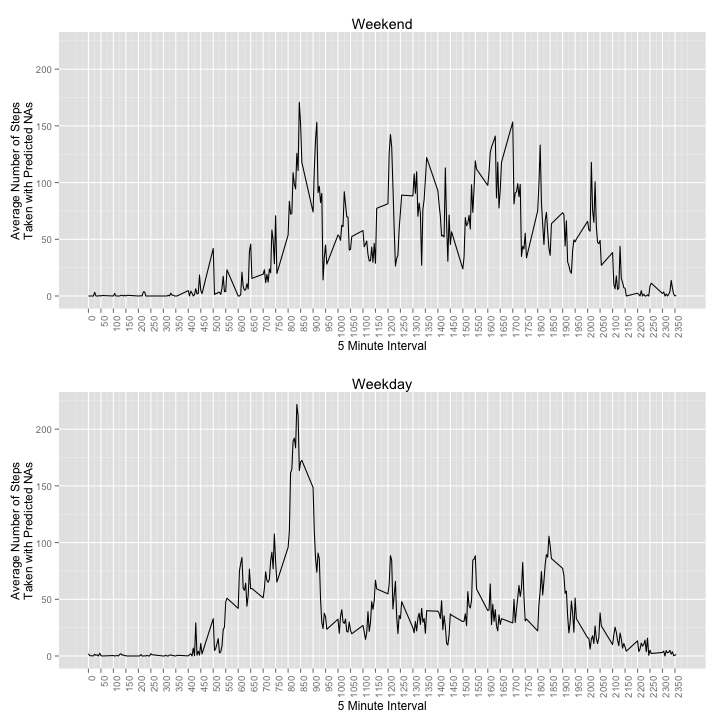

Reproducible Research - Assignment 1
================================

## Loading and preprocessing the data

The initial section (shown below) includes code in case the source data has not been downloaded.  Uncomment the code provided to download the data and untar it.  

The data included in the repository was downloaded on August 9th, 2014 from the URL shown in the code chunk below.

The assumption, however, is that the data is available and in the current working directory.  

In the code chunk below, libraries are loaded for plotting using ggplot, the input data is read, rows with steps data unavailable are removed, the number of steps by day are summed.


```r
# COMMENT : download and untar the files 
# url <- 'https://d396qusza40orc.cloudfront.net/repdata%2Fdata%2Factivity.zip'
# download.file(url, destfile="./repdata-data-activity.zip",method="curl")
# untar("./repdata-data-activity.zip", compressed = 'gzip')
library(scales)
library(ggplot2)

# read input data 
input <- read.csv('./activity.csv')

#convert date column to date format
input$date <- as.Date(input$date, format = "%Y-%m-%d")

# remove values with missing steps data 
inputMinusNA <- input[!(is.na(input$steps)),]

# determine the sum of steps from the remaining data set
freqs <- aggregate(inputMinusNA$steps, by=list(inputMinusNA$date), FUN=sum)
freqs$names <- as.Date(freqs$Group.1, format="%Y-%m-%d")
```

## What is mean total number of steps taken per day?

In the code chunk below, the data is plotted in a histogram and the mean and median steps taken are determined.


```r
# create histogram
ggplot(freqs, aes(x=names, y=x)) + geom_bar(stat="identity") +
    theme(axis.text.x = element_text(angle = 90, hjust = 1)) +  
    scale_x_date(breaks=freqs$names) +
    labs(x = "Date",
         y = "Steps",
         title = "Total Steps by Date")
```

 

```r
theMean <- mean(freqs$x)
theMedian <- median(freqs$x)
```

### Mean and Median

When the NA values are omitted, the mean steps by date is 1.0766 &times; 10<sup>4</sup> and the median is 10765.

## average daily activity pattern

In the code chunk below, the average number of steps by 5 minute interval are determined and plotted using a line graph, and the 5 minute interval with the max number of steps is determined.


```r
byInterval <- aggregate(inputMinusNA$steps, by=list(inputMinusNA$interval), FUN=mean)

ggplot(byInterval) + geom_line(aes(x=Group.1, y=x)) +
    theme(axis.text.x = element_text(angle = 90, hjust = 1)) +  
    scale_x_continuous(breaks=seq(from=min(byInterval$Group.1), to=max(byInterval$Group.1), by=50)) + 
    labs(x = "5 Minute Interval",
         y = "Average Steps Taken",
         title = "Average Number of Steps Taken by Five Minute Interval",col="")         
```

 

```r
theMax <- byInterval[ which(byInterval$x==(max(byInterval$x))),]$Group.1
```

## Imputing missing values

In this section, the mice library is loaded, which will be used to replace the NA values from the original data set.  In this case, predictive mean matching was chosen after considering Bayesian linear regression, predictive mean matching and linear regression.

A summary is done over the input data set to show the count of NAs, but the value is also provided later in this document.

The NA values are replaced, summaries are generated, total steps by day are plotted and the dayType (weekday or weekend) factor is created for later use.


```r
library(mice)

countNA <- nrow(input[is.na(input$steps),])

### NOTE: could also have ouput the NA count using Summary, as shown below
summary(input)
```

```
##      steps            date               interval   
##  Min.   :  0.0   Min.   :2012-10-01   Min.   :   0  
##  1st Qu.:  0.0   1st Qu.:2012-10-16   1st Qu.: 589  
##  Median :  0.0   Median :2012-10-31   Median :1178  
##  Mean   : 37.4   Mean   :2012-10-31   Mean   :1178  
##  3rd Qu.: 12.0   3rd Qu.:2012-11-15   3rd Qu.:1766  
##  Max.   :806.0   Max.   :2012-11-30   Max.   :2355  
##  NA's   :2304
```

```r
## Using Predictive mean matching and the mice package to replace NA values in steps
steps <- input$steps
intervals <- input$interval
combined <- data.frame(steps,intervals)
imp <- mice(combined,print=FALSE,meth="pmm")
inputAdjusted <- cbind((complete(imp)),date=input$date)

adjustedFreqs <- aggregate(inputAdjusted$steps, by=list(inputAdjusted$date), FUN=sum)
adjustedFreqs$names <- as.Date(adjustedFreqs$Group.1, format="%Y-%m-%d")


ggplot(adjustedFreqs, aes(x=names, y=x)) + geom_bar(stat="identity") +
    theme(axis.text.x = element_text(angle = 90, hjust = 1)) +  
    scale_x_date(breaks=adjustedFreqs$names) +
    labs(x = "Date",
         y = "Steps",
         title = "Total Steps by Date With Predicted Missing Values")
```

 

```r
adjustedMean <- mean(adjustedFreqs$x)
adjustedMedian <- median(adjustedFreqs$x)

inputAdjusted$dayType <- sapply(weekdays(inputAdjusted$date), switch, 
                                 "Saturday"  = "Weekend", 
                                 "Sunday"    = "Weekend", 
                                 "Monday"    = "Weekday", 
                                 "Tuesday"   = "Weekday",
                                 "Wednesday" = "Weekday",
                                 "Thursday"  = "Weekday",
                                 "Friday"    = "Weekday")

inputAdjusted$dayType <- as.factor(inputAdjusted$dayType)
```

### Count of NAs

The number of NAs in the input data is 2304.

### Adjusted Mean and Median

When the NA values are simulated, the mean steps by day becomes 1.0988 &times; 10<sup>4</sup> and the median becomes 11162 (compared to previous mean/median values of 1.0766 &times; 10<sup>4</sup>/10765.

In order to (easily) create a panel graph with ggplot, the following function is used:


```r
## create multiplot function
multiplot <- function(..., plotlist=NULL, file, cols=1, layout=NULL) {
  require(grid)

  # Make a list from the ... arguments and plotlist
  plots <- c(list(...), plotlist)

  numPlots = length(plots)

  # If layout is NULL, then use 'cols' to determine layout
  if (is.null(layout)) {
    # Make the panel
    # ncol: Number of columns of plots
    # nrow: Number of rows needed, calculated from # of cols
    layout <- matrix(seq(1, cols * ceiling(numPlots/cols)),
                    ncol = cols, nrow = ceiling(numPlots/cols))
  }

 if (numPlots==1) {
    print(plots[[1]])
  } else {
    # Set up the page
    grid.newpage()
    pushViewport(viewport(layout = grid.layout(nrow(layout), ncol(layout))))

    # Make each plot, in the correct location
    for (i in 1:numPlots) {
      # Get the i,j matrix positions of the regions that contain this subplot
      matchidx <- as.data.frame(which(layout == i, arr.ind = TRUE))

      print(plots[[i]], vp = viewport(layout.pos.row = matchidx$row,
                                      layout.pos.col = matchidx$col))
    }
  }
}
```

## Weekdays versus Weekends

In the final code chunk, the adjusted (replaced NA values) data is split by weekday or weekend.  The resulting data sets are aggregated to obtain the means by interval.  The resulting data sets are plotted and then combined to create a panel display containing two separate line graphs, using the multiplot function shown earlier, in order to leverage gglplot.


```r
### Create Weekends Data Set
weekends <- sample(inputAdjusted[inputAdjusted$dayType=="Weekend",])

### Create Weekdays Data Set
weekdays <- sample(inputAdjusted[inputAdjusted$dayType=="Weekday",])

weekendInterval <- aggregate(weekends$steps, by=list(weekends$interval), FUN=mean)
weekdayInterval <- aggregate(weekdays$steps, by=list(weekdays$interval), FUN=mean)

p1 <- ggplot(weekendInterval) + geom_line(aes(x=Group.1, y=x)) +
          theme(axis.text.x = element_text(angle = 90, hjust = 1)) +  
          scale_x_continuous(breaks=seq(from=min(weekendInterval$Group.1), to=max(weekendInterval$Group.1), by=50)) + 
          scale_y_continuous(limits=c(0,max(weekdayInterval$x))) +     
          labs(x = "5 Minute Interval",
               y = "Average Number of Steps\nTaken with Predicted NAs",
               title = "Weekend",col="")         

p2 <- ggplot(weekdayInterval) + geom_line(aes(x=Group.1, y=x)) +
          theme(axis.text.x = element_text(angle = 90, hjust = 1)) +  
          scale_x_continuous(breaks=seq(from=min(weekdayInterval$Group.1), to=max(weekdayInterval$Group.1), by=50)) + 
          scale_y_continuous(limits=c(0,max(weekdayInterval$x))) +     
          labs(x = "5 Minute Interval",
               y = "Average Number of Steps\nTaken with Predicted NAs",
               title = "Weekday",col="")         

multiplot(p1, p2, cols=1)
```

 

